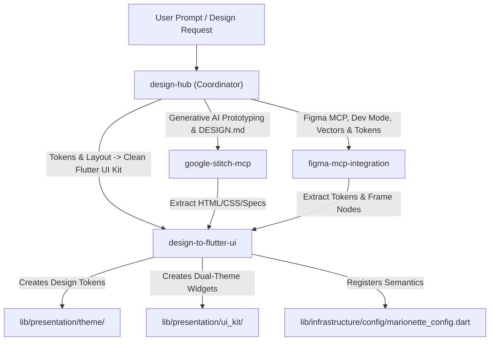

# Design & Prototyping Coordinator: Google Stitch, Figma & UI Kit Synthesis

## 1. Overview & Scope

The **Design Domain** connects visual UI/UX design workflows, generative AI UI prototyping (Google Stitch), design token systems, and Figma asset pipelines directly to production-ready Flutter Clean Architecture code.

---

## 2. Skill Tree & Routing Matrix

Use this routing decision matrix to navigate to the specialized sub-skill matching your task:

| Task / User Intent | Target Sub-Skill | Purpose |
| :--- | :--- | :--- |
| **Google Stitch MCP:** Generate screens from text, iterate with `edit_screens`, generate screen variants, upload `DESIGN.md`, manage Stitch design systems | [google-stitch-mcp](../google-stitch-mcp/SKILL.md) | Generative UI design, screen iteration, and Stitch MCP tool workflows |
| **Figma MCP & Dev Mode:** Inspect Figma files, extract node hierarchies, auto-layout parameters, component variants, export vector SVGs | [figma-mcp-integration](../figma-mcp-integration/SKILL.md) | Figma MCP automation, REST API queries, Dev Mode token extraction, and asset exporting |
| **Design-to-Flutter Synthesis:** Convert Stitch/Figma layouts into Flutter Clean Architecture widgets, Material 3 `ColorScheme`, `ThemeExtension`, dual-theme `@Preview` | [design-to-flutter-ui](../design-to-flutter-ui/SKILL.md) | Translating visual specifications into strictly modular, dual-theme, accessible Flutter components |

---

## 3. Global Design Invariants & Project Constraints

Whenever designing or translating UI from Stitch or Figma into Flutter:

1. **Zero Hardcoded Colors:**
   - NEVER use `Color(0x...)` or static color constants directly in UI widgets.
   - All colors must route through `context.colorScheme` (Material 3) or custom `ThemeExtension` (e.g., `context.customColors`).
2. **Dual-Theme Support (Light & Dark):**
   - Every color, surface, and custom token must have explicit, high-contrast values for both Light and Dark modes.
3. **Mandatory @Preview Dual-Theme Coverage:**
   - Every generated UI Kit component in `lib/presentation/ui_kit/` must have top-level `@Preview` functions wrapped in `PreviewWrapper` for both Light and Dark modes.
4. **Widget Decomposition & File Limits:**
   - Keep screen/widget files strictly within **150–200 lines**.
   - Prohibit helper builder methods (e.g. `Widget _buildHeader()`); extract them into dedicated `StatelessWidget` classes.
5. **Marionette Semantics Registration:**
   - All interactive components (buttons, cards, chips, input fields) must be registered in `AppMarionetteConfig` or wrapped in `Semantics` with clear labels for AI runtime driving.

---

## 4. Shared Verification Checklist

When coordinating design tasks:
- [ ] Task routed to the appropriate specialized sub-skill (`google-stitch-mcp`, `figma-mcp-integration`, or `design-to-flutter-ui`).
- [ ] Design tokens synchronized with `AppTheme` and `ThemeExtension` (`AppCustomColors`).
- [ ] UI Kit components include dual-theme `@Preview` functions and preview showcase verification.
- [ ] Interactive elements registered with `Semantics` / `AppMarionetteConfig`.
