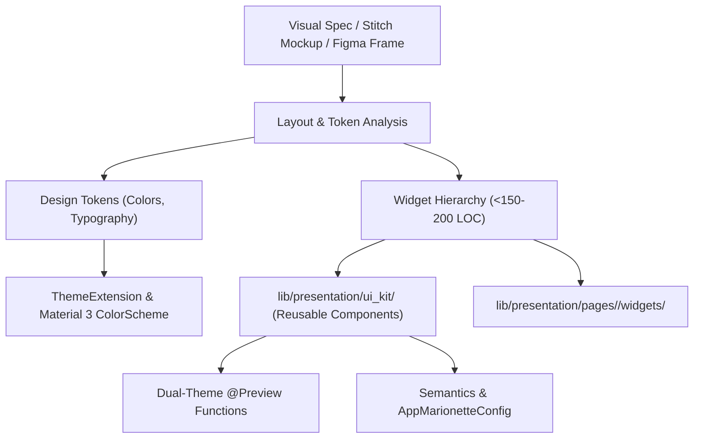

# Design-to-Flutter UI Synthesis: Clean Architecture & UI Kit Standards

## 1. Overview & Architectural Role

This skill defines the transformation pipeline from visual design artifacts (generated via Google Stitch, inspected in Figma, or outlined in `DESIGN.md`) into production-grade Flutter presentation layer code.

All synthesized UI code MUST strictly adhere to the following architectural invariants:



---

## 2. Prerequisites & Related Skills

| Relation | Skill | When to Consult |
| :--- | :--- | :--- |
| **Parent Hub** | [design-hub](../design-hub/SKILL.md) | For overall design routing |
| **Upstream Sources** | [google-stitch-mcp](../google-stitch-mcp/SKILL.md) / [figma-mcp-integration](../figma-mcp-integration/SKILL.md) | For source mockups and design token data |
| **UI Components** | [flutter-ui-kit-components](../../presentation/ui/ui-kit/flutter-ui-kit-components/SKILL.md) | For standard UI Kit atomic patterns |
| **Theming** | [flutter-ui-theme-extensions](../../presentation/theme/flutter-ui-theme-extensions/SKILL.md) | For `ThemeExtension` and `ColorScheme` setup |
| **Extensions** | [flutter-ui-utils-extensions](../../presentation/ui-utils/flutter-ui-utils-extensions/SKILL.md) | For `BuildContextX` (`context.colorScheme`, etc.) |
| **AI Runtime Driving** | [marionette-hub](../../testing/marionette/marionette-hub/SKILL.md) | For widget interaction and accessibility driving |

---

## 3. Strict UI & Clean Architecture Invariants

1. **Max File Size (150–200 LOC):**
   - No single Dart file in `lib/presentation/` may exceed **200 lines**.
   - Decompose screens into small, single-responsibility sub-widgets in `lib/presentation/pages/<feature>/widgets/`.
2. **Zero Helper Builder Methods:**
   - Methods like `Widget _buildHeader()` or `Widget _buildCard()` inside widget classes are **STRICTLY PROHIBITED**.
   - Extract every sub-section into a standalone `StatelessWidget` class.
3. **Zero Hardcoded Colors:**
   - Raw `Color(0x...)` or static color classes in UI widgets are forbidden.
   - Access colors exclusively via `context.colorScheme` or `context.customColors`.
4. **Mandatory Dual-Theme `@Preview` Coverage:**
   - Every component in `lib/presentation/ui_kit/` MUST declare top-level `@Preview` functions wrapped in `PreviewWrapper` for both **Light** and **Dark** themes.
5. **Marionette Semantics & Accessibility:**
   - Wrap interactive touch targets with `Semantics(button: true, label: '...', child: ...)` or register custom widget types in `AppMarionetteConfig` (`lib/infrastructure/config/marionette_config.dart`).

---

## 4. Production Implementation Patterns

### 4.1 Pattern 1: Authoring a Dual-Theme UI Kit Component

`lib/presentation/ui_kit/app_card_tile.dart`:
```dart
import 'package:flutter/material.dart';
import 'package:flutter/widget_previews.dart';
import 'package:flutter_template/presentation/pages/uikit/preview_wrapper.dart';
import 'package:flutter_template/presentation/ui_utils/extensions/build_context_x.dart';

enum AppCardTileVariant { elevated, outlined }

class AppCardTile extends StatelessWidget {
  final String title;
  final String subtitle;
  final Widget? leading;
  final Widget? trailing;
  final VoidCallback? onTap;
  final AppCardTileVariant variant;

  const AppCardTile({
    super.key,
    required this.title,
    required this.subtitle,
    this.leading,
    this.trailing,
    this.onTap,
    this.variant = AppCardTileVariant.elevated,
  });

  @override
  Widget build(BuildContext context) {
    final colorScheme = context.colorScheme;
    final textTheme = context.textTheme;

    final isElevated = variant == AppCardTileVariant.elevated;
    final backgroundColor = isElevated
        ? colorScheme.surfaceContainerHigh
        : colorScheme.surface;
    final border = isElevated
        ? null
        : Border.all(color: colorScheme.outlineVariant);

    return Semantics(
      button: onTap != null,
      label: '$title, $subtitle',
      child: Material(
        color: backgroundColor,
        borderRadius: BorderRadius.circular(16),
        child: InkWell(
          onTap: onTap,
          borderRadius: BorderRadius.circular(16),
          child: Container(
            padding: const EdgeInsets.all(16),
            decoration: BoxDecoration(
              borderRadius: BorderRadius.circular(16),
              border: border,
            ),
            child: Row(
              children: [
                if (leading != null) ...[
                  leading!,
                  const SizedBox(width: 12),
                ],
                Expanded(
                  child: Column(
                    crossAxisAlignment: CrossAxisAlignment.start,
                    mainAxisSize: MainAxisSize.min,
                    children: [
                      Text(
                        title,
                        style: textTheme.titleMedium?.copyWith(
                          color: colorScheme.onSurface,
                          fontWeight: FontWeight.w600,
                        ),
                      ),
                      const SizedBox(height: 4),
                      Text(
                        subtitle,
                        style: textTheme.bodySmall?.copyWith(
                          color: colorScheme.onSurfaceVariant,
                        ),
                      ),
                    ],
                  ),
                ),
                if (trailing != null) ...[
                  const SizedBox(width: 12),
                  trailing!,
                ],
              ],
            ),
          ),
        ),
      ),
    );
  }
}

// ---------------------------------------------------------------------------
// Dual-Theme Widget Previews
// ---------------------------------------------------------------------------

@Preview(name: 'AppCardTile - Light Theme', size: Size(360, 100))
Widget previewAppCardTileLight() {
  return const PreviewWrapper(
    brightness: Brightness.light,
    child: AppCardTile(
      title: 'Primary Account',
      subtitle: 'Balance: $12,450.00',
      variant: AppCardTileVariant.elevated,
    ),
  );
}

@Preview(name: 'AppCardTile - Dark Theme', size: Size(360, 100))
Widget previewAppCardTileDark() {
  return const PreviewWrapper(
    brightness: Brightness.dark,
    child: AppCardTile(
      title: 'Primary Account',
      subtitle: 'Balance: $12,450.00',
      variant: AppCardTileVariant.elevated,
    ),
  );
}
```

---

### 4.2 Pattern 2: Decomposing a Complex Screen from Design Specs

When synthesizing a full page mockup (e.g. `DashboardPage`), break the design into separate sub-widgets inside `lib/presentation/pages/dashboard/widgets/`:

```text
lib/presentation/pages/dashboard/
├── dashboard_page.dart                 # Master Sliver Scaffold (<100 LOC)
└── widgets/
    ├── dashboard_balance_card.dart     # Balance header & graph (<120 LOC)
    ├── dashboard_quick_actions.dart    # Action buttons row (<90 LOC)
    ├── dashboard_recent_list.dart      # Transaction sliver list (<140 LOC)
    └── dashboard_transaction_item.dart # Single transaction row (<110 LOC)
```

---

## 5. Anti-Patterns & Severity Matrix

| Anti-Pattern | Severity | Why It Fails | Corrective Action |
| :--- | :--- | :--- | :--- |
| **Hardcoding Hex Colors in Widgets** | **CRITICAL** | Colors don't adapt to theme changes; breaks dark mode. | Access colors via `context.colorScheme` or `context.customColors`. |
| **Omitting Dual-Theme Previews** | **HIGH** | Breaks visual regression verification and UI Kit standards. | Add top-level `@Preview` functions for both Light and Dark modes. |
| **Helper `_build*` Methods** | **HIGH** | Causes unnecessary subtree rebuilds and degrades UI performance. | Extract into dedicated `StatelessWidget` sub-classes. |
| **Relative File Imports** | **MEDIUM** | Violates linting standard; breaks refactoring safety. | Use package imports (`import 'package:flutter_template/...';`). |

---

## 6. Agent Verification Checklist

When synthesizing UI from designs:
- [ ] File sizes stay within 150–200 lines.
- [ ] No private helper `_build*` methods used.
- [ ] All colors fetched from `context.colorScheme` or `context.customColors`.
- [ ] Dual-theme `@Preview` functions authored using `PreviewWrapper`.
- [ ] Interactive widgets wrapped in `Semantics` or registered in `AppMarionetteConfig`.
- [ ] Code formatted and sorted using `dart run import_sorter:main`.
