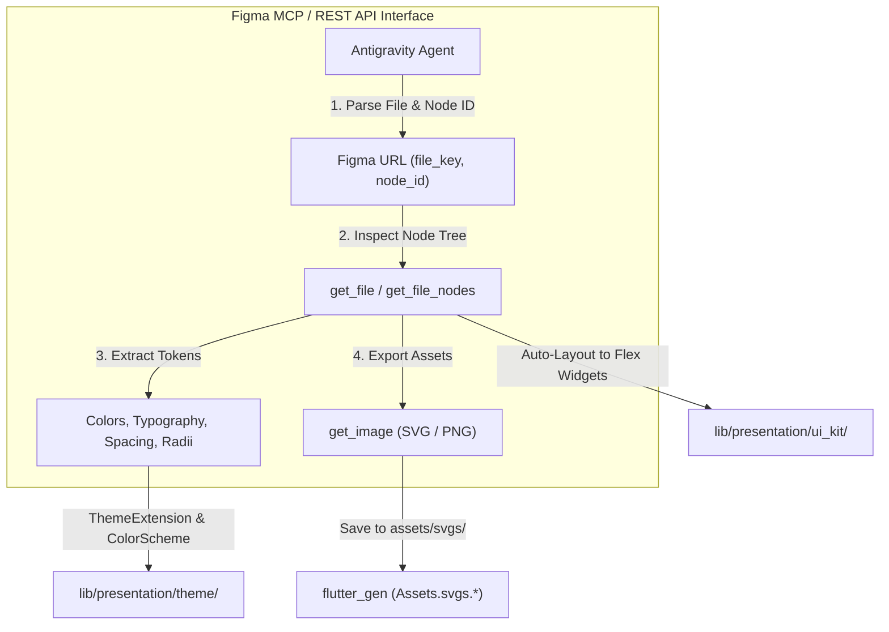

# Figma MCP Integration: Design Tokens, Auto-Layout & Component Synthesis

## 1. Overview & Tooling Architecture

The **Figma Integration** skill guides agents in interfacing with Figma through Model Context Protocol (MCP) servers, Figma REST APIs, and Dev Mode metadata. It automates the extraction of design tokens, translates Auto-layout constraints into responsive Flutter layout trees, and exports vector assets directly into the project's asset pipeline.



---

## 2. Prerequisites & Related Skills

| Relation | Skill | When to Consult |
| :--- | :--- | :--- |
| **Parent Hub** | [design-hub](../design-hub/SKILL.md) | For overall design routing and global constraints |
| **Downstream** | [design-to-flutter-ui](../design-to-flutter-ui/SKILL.md) | For translating extracted tokens and widgets into Flutter Clean Architecture |
| **Asset Pipeline** | [dart-import-sorter](../../dart-import-sorter/SKILL.md) / [flutter-build-runner](../../flutter-build-runner/SKILL.md) | For asset generation and import formatting |
| **Tooling Hub** | [mcp-tooling-hub](../../tooling/mcp-tooling-hub/SKILL.md) | For MCP server ecosystem reference |

---

## 3. Figma Data Structures & Extraction Mechanics

### 3.1 Resolving Figma URLs & Identifiers

Figma URLs follow the standard structure:
`https://www.figma.com/design/:file_key/:file_title?node-id=:node_id`

- **`file_key`:** The unique document hash (e.g. `aB1cDeFgHiJkLmNoPqRsTu`).
- **`node_id`:** The target frame, component, or canvas ID. Note: In API calls, URL colons (`123:456`) are formatted as `123:456` or `123-456` depending on endpoint.

---

### 3.2 Auto-Layout to Flutter Layout Mapping

Figma Auto-layout translates directly to Flutter layout primitives:

| Figma Auto-Layout Property | Figma Value | Flutter Equivalent |
| :--- | :--- | :--- |
| **Layout Direction** | `HORIZONTAL` | `Row(mainAxisSize: MainAxisSize.min, ...)` or `Row(children: ...)` |
| **Layout Direction** | `VERTICAL` | `Column(mainAxisSize: MainAxisSize.min, ...)` or `Column(children: ...)` |
| **Layout Wrap** | `WRAP` | `Wrap(spacing: gap, runSpacing: runGap, ...)` |
| **Item Spacing (Gap)** | `gap: 16` | `SizedBox(width: 16)` / `SizedBox(height: 16)` or `spacing: 16` in `Flex` |
| **Padding** | `top, right, bottom, left` | `EdgeInsets.only(top: ..., right: ..., bottom: ..., left: ...)` or `EdgeInsets.symmetric(...)` |
| **Primary Axis Align** | `MIN` / `CENTER` / `MAX` / `SPACE_BETWEEN` | `MainAxisAlignment.start` / `center` / `end` / `spaceBetween` |
| **Counter Axis Align** | `MIN` / `CENTER` / `MAX` / `STRETCH` | `CrossAxisAlignment.start` / `center` / `end` / `stretch` |
| **Item Sizing** | `FIXED` | `SizedBox(width: w, height: h)` or fixed constraint |
| **Item Sizing** | `FILL` / `HUG` | `Expanded(child: ...)` / `Flexible(child: ...)` / intrinsic content size |

---

### 3.3 Design Tokens & Variable Extraction

| Figma Token | Figma Source | Flutter Architecture Destination |
| :--- | :--- | :--- |
| **Brand & Surface Colors** | Color Styles / Variables (Light + Dark modes) | `context.colorScheme` (`primary`, `surface`, `onSurface`, etc.) |
| **Custom Status / Action Colors** | Custom Variable Collections (`trade_call`, `badge_warning`) | `AppCustomColors` (`ThemeExtension`) in `lib/presentation/theme/` |
| **Typography** | Text Styles (`fontSize`, `fontWeight`, `lineHeight`) | `context.textTheme` (`titleMedium`, `bodyLarge`, etc.) |
| **Corner Radii** | `cornerRadius` / `rectangleCornerRadii` | `BorderRadius.circular(12)` or `ThemeData.shape` |
| **Elevation & Drop Shadows** | `effects: [DROP_SHADOW]` | `BoxShadow(color: ..., blurRadius: ..., offset: ...)` |

---

## 4. Step-by-Step Workflows

### 4.1 Workflow 1: Extract Design Tokens & Color Palettes

1. **Query Variables / Styles:** Inspect color and typography collections in the Figma document.
2. **Define Custom ThemeExtension:**
   Add domain/custom tokens to `AppCustomColors` in `lib/presentation/theme/app_custom_colors.dart`:
   ```dart
   import 'package:flutter/material.dart';

   class AppCustomColors extends ThemeExtension<AppCustomColors> {
     final Color successSurface;
     final Color warningSurface;
     final Color tradeCall;
     final Color tradePut;

     const AppCustomColors({
       required this.successSurface,
       required this.warningSurface,
       required this.tradeCall,
       required this.tradePut,
     });

     @override
     AppCustomColors copyWith({
       Color? successSurface,
       Color? warningSurface,
       Color? tradeCall,
       Color? tradePut,
     }) {
       return AppCustomColors(
         successSurface: successSurface ?? this.successSurface,
         warningSurface: warningSurface ?? this.warningSurface,
         tradeCall: tradeCall ?? this.tradeCall,
         tradePut: tradePut ?? this.tradePut,
       );
     }

     @override
     AppCustomColors lerp(ThemeExtension<AppCustomColors>? other, double t) {
       if (other is! AppCustomColors) return this;
       return AppCustomColors(
         successSurface: Color.lerp(successSurface, other.successSurface, t)!,
         warningSurface: Color.lerp(warningSurface, other.warningSurface, t)!,
         tradeCall: Color.lerp(tradeCall, other.tradeCall, t)!,
         tradePut: Color.lerp(tradePut, other.tradePut, t)!,
       );
     }
   }
   ```
3. **Register Light and Dark Instances:** Add configured instances to `lightTheme` and `darkTheme` in `lib/presentation/theme/app_theme.dart`.

---

### 4.2 Workflow 2: Export Vector Icons to `assets/svgs/` with `flutter_gen`

1. **Export SVG Assets:** Save optimized SVG icons into `assets/svgs/` using lowercase snake_case naming (e.g., `ic_arrow_up.svg`, `ic_wallet.svg`).
2. **Run Asset Generation:**
   Execute build runner or flutter_gen:
   ```bash
   flutter pub run build_runner build --delete-conflicting-outputs
   ```
3. **Consume Generated Asset:**
   ```dart
   import 'package:flutter_template/presentation/ui_utils/assets/assets.gen.dart';
   import 'package:flutter_template/presentation/ui_utils/extensions/build_context_x.dart';

   Widget buildIcon(BuildContext context) {
     return Assets.svgs.icWallet.svg(
       width: 24,
       height: 24,
       colorFilter: ColorFilter.mode(
         context.colorScheme.primary,
         BlendMode.srcIn,
       ),
     );
   }
   ```

---

### 4.3 Workflow 3: Map Component Sets & Variants to Flutter UI Kit

When translating a Figma component with multiple variants (e.g. `AppButton` with `variant: primary | secondary | outline`, `size: sm | md | lg`, `state: default | disabled | loading`):

1. **Model Variant Enums in UI Kit:**
   ```dart
   enum AppButtonVariant { primary, secondary, outline }
   enum AppButtonSize { sm, md, lg }
   ```
2. **Construct `StatelessWidget`:**
   Keep file within 150–200 lines in `lib/presentation/ui_kit/app_button.dart`.
3. **Author Dual-Theme `@Preview` Functions:**
   Create `@Preview` functions wrapped in `PreviewWrapper` for both Light and Dark themes.
4. **Register in `AppMarionetteConfig`:**
   Register the component in `lib/infrastructure/config/marionette_config.dart` or wrap in `Semantics`.

---

## 5. Anti-Patterns & Severity Matrix

| Anti-Pattern | Severity | Why It Fails | Corrective Action |
| :--- | :--- | :--- | :--- |
| **Hardcoding Raw Hex Values from Figma** | **CRITICAL** | Hardcoded colors (`Color(0xFF1E88E5)`) break dark theme switching and violate UI guidelines. | Extract colors into `ColorScheme` or `AppCustomColors` `ThemeExtension`. |
| **Absolute Coordinate Layout (`Positioned` Abuse)** | **HIGH** | Using fixed X/Y coordinates instead of Auto-layout flex containers breaks multi-screen responsiveness. | Translate Auto-layout to `Row`, `Column`, `Wrap`, `Flex`, and `Padding`. |
| **Skipping `flutter_gen` for Vector SVGs** | **HIGH** | Raw string asset paths (`SvgPicture.asset('assets/...')`) lack compile-time safety. | Save to `assets/svgs/` and access via `Assets.svgs.<name>.svg()`. |
| **Helper Builder Methods in Large Classes** | **MEDIUM** | Deeply nested `Widget _buildRow()` methods prevent granular element repainting. | Extract into dedicated `StatelessWidget` sub-classes. |

---

## 6. Agent Verification Checklist

When extracting from Figma or building UI from Figma specs:
- [ ] Auto-layout translated to responsive Flutter layout primitives (`Row`, `Column`, `Wrap`, `Expanded`).
- [ ] All colors route strictly through `context.colorScheme` or `context.customColors`.
- [ ] Both Light and Dark theme palettes are supported without visual glitches.
- [ ] Icons exported as clean SVGs in `assets/svgs/` and accessed via `Assets.svgs.*`.
- [ ] Dual-theme `@Preview` functions included in the UI Kit component file.
- [ ] Interactive widgets registered with `Semantics` / `AppMarionetteConfig`.
