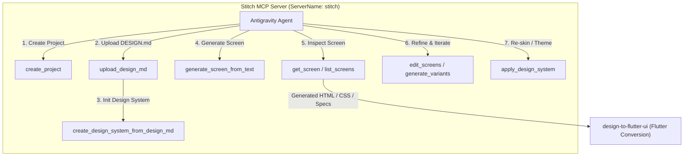

# Google Stitch MCP: Generative UI Prototyping & Design System Workflows

## 1. Overview & Tooling Architecture

**Google Stitch** is an AI-powered visual design and frontend prototyping engine. Through the `stitch` Model Context Protocol (MCP) server, agents can programmatically bootstrap design projects, upload markdown design tokens (`DESIGN.md`), generate high-fidelity mobile/desktop UI mockups from text prompts, iterate on screen variations, and inspect generated components.



---

## 2. Prerequisites & Related Skills

| Relation | Skill | When to Consult |
| :--- | :--- | :--- |
| **Parent Hub** | [design-hub](../design-hub/SKILL.md) | For global UI architecture, tokens, and routing |
| **Sibling Skill** | [figma-mcp-integration](../figma-mcp-integration/SKILL.md) | When comparing or integrating Figma components with Stitch mockups |
| **Downstream** | [design-to-flutter-ui](../design-to-flutter-ui/SKILL.md) | For translating generated Stitch screens into Flutter widgets & UI Kit |
| **Tooling Hub** | [mcp-tooling-hub](../../tooling/mcp-tooling-hub/SKILL.md) | For general Antigravity MCP server catalog and conventions |

---

## 3. Stitch MCP Tools Reference

All Stitch tools are called via `call_mcp_tool` with `ServerName: "stitch"`.

### 3.1 Project & Screen Management

| Tool Name | Parameters | Purpose |
| :--- | :--- | :--- |
| `create_project` | `{ "title": "string" }` | Creates a new Stitch container project for UI screens. |
| `get_project` | `{ "projectId": "string" }` | Retrieves project details, screen instances, and linked design systems. |
| `list_projects` | `{}` | Lists all active Stitch projects. |
| `delete_project` | `{ "projectId": "string" }` | Deletes a Stitch project. |
| `list_screens` | `{ "projectId": "string" }` | Lists all screens generated within a project. |
| `get_screen` | `{ "name": "projects/{projectId}/screens/{screenId}" }` | Retrieves full screen metadata, component hierarchy, and HTML/CSS representations. |

### 3.2 AI Screen Generation & Iteration

| Tool Name | Key Parameters | Instructions & Nuances |
| :--- | :--- | :--- |
| `generate_screen_from_text` | `projectId` (req), `prompt` (req), `deviceType` (`MOBILE`, `DESKTOP`, `TABLET`, `AGNOSTIC`), `modelId` (`GEMINI_3_8_FLASH`, `GEMINI_3_5_FLASH_LITE`), `designSystem` (opt) | **Timeout Protocol:** Generation may take 1–3 minutes. DO NOT retry immediately. If a timeout occurs, poll `get_screen` every 30s up to 10 times.<br/>**Output Suggestions:** If `output_components` contains suggestions (e.g. *"Yes, make them all"*), present them to the user or accept and re-invoke. |
| `edit_screens` | `projectId` (req), `selectedScreenIds` (req array), `prompt` (req), `deviceType` (opt), `modelId` (opt) | Edits existing screens in-place based on revision instructions (e.g. *"Change header to dark glassmorphism and add transaction filter chips"*). |
| `generate_variants` | `projectId` (req), `selectedScreenIds` (req array), `prompt` (req) | Generates alternative aesthetic or layout variations for user selection. |

### 3.3 Design System & `DESIGN.md` Management

| Tool Name | Parameters | Instructions & Nuances |
| :--- | :--- | :--- |
| `upload_design_md` | `projectId` (req), `designMdBase64` (req base64 UTF-8) | Uploads markdown design system specification. Pass base64-encoded UTF-8 string (`base64 -w 0 DESIGN.md`). |
| `create_design_system_from_design_md` | `projectId` (req) | MUST be called immediately following `upload_design_md` to parse and activate the design system in Stitch. |
| `list_design_systems` | `{ "projectId": "string" }` | Lists available design systems and returns `assetId` for screen application. |
| `apply_design_system` | `projectId` (req), `assetId` (req), `selectedScreenInstances` (req array of `{ "id": "...", "sourceScreen": "projects/.../screens/..." }`) | Applies design tokens (colors, typography, radii) from a design system to existing screen instances. |

---

## 4. End-to-End Workflows

### 4.1 Workflow 1: Bootstrap Project from `DESIGN.md`

When standardizing a project's design tokens into Stitch:

1. **Prepare `DESIGN.md`:** Structure colors (Light & Dark hex values), typography scales, spacing tokens (4px/8px grid), and border radii.
2. **Create Stitch Project:**
   ```json
   {
     "ServerName": "stitch",
     "ToolName": "create_project",
     "Arguments": { "title": "App Design System" }
   }
   ```
3. **Encode & Upload `DESIGN.md`:**
   Encode `DESIGN.md` to base64 and call:
   ```json
   {
     "ServerName": "stitch",
     "ToolName": "upload_design_md",
     "Arguments": {
       "projectId": "4044680601076201931",
       "designMdBase64": "<base64_string>"
     }
   }
   ```
4. **Instantiate Design System:**
   ```json
   {
     "ServerName": "stitch",
     "ToolName": "create_design_system_from_design_md",
     "Arguments": { "projectId": "4044680601076201931" }
   }
   ```

---

### 4.2 Workflow 2: Generate & Iterate High-Fidelity Screens

1. **Invoke `generate_screen_from_text`:**
   ```json
   {
     "ServerName": "stitch",
     "ToolName": "generate_screen_from_text",
     "Arguments": {
       "projectId": "4044680601076201931",
       "prompt": "Modern financial dashboard with total balance card, quick actions row, recent transactions list with status badges, and bottom navigation bar in dark mode",
       "deviceType": "MOBILE",
       "modelId": "GEMINI_3_8_FLASH"
     }
   }
   ```
2. **Handle Async Execution & Polling:**
   - If the tool completes, inspect the returned screen details.
   - If a transient network timeout occurs, call `get_screen` with the screen resource identifier after 30 seconds.
3. **Refine Design with `edit_screens`:**
   ```json
   {
     "ServerName": "stitch",
     "ToolName": "edit_screens",
     "Arguments": {
       "projectId": "4044680601076201931",
       "selectedScreenIds": ["98b50e2ddc9943efb387052637738f61"],
       "prompt": "Increase spacing between transaction items, add avatar icons to each transaction, and style the balance card with a subtle gradient"
     }
   }
   ```

---

### 4.3 Workflow 3: Stitch-to-Flutter Translation Pipeline

Once screens are finalized in Stitch:

1. **Fetch Screen Details:** Call `get_screen` to inspect the generated HTML structure, CSS rules, and component hierarchy.
2. **Extract Design Tokens:** Map Stitch color codes and font sizes into `AppCustomColors` (`ThemeExtension`) and Material 3 `ColorScheme` via [design-to-flutter-ui](../design-to-flutter-ui/SKILL.md).
3. **Decompose Widgets:** Break down HTML sections into focused Flutter widgets (<150–200 LOC per file) inside `lib/presentation/pages/<feature>/widgets/` or `lib/presentation/ui_kit/`.
4. **Generate Dual-Theme Previews:** Wrap all new widgets with `@Preview` functions using `PreviewWrapper`.

---

## 5. Anti-Patterns & Severity Matrix

| Anti-Pattern | Severity | Why It Fails | Corrective Action |
| :--- | :--- | :--- | :--- |
| **Immediate Retries on Timeout** | **CRITICAL** | Generates duplicate jobs, wastes compute tokens, and causes concurrent state conflicts. | Follow timeout protocol: wait 30s and poll `get_screen` up to 10 times. |
| **Hardcoding Stitch Hex Colors in Flutter** | **CRITICAL** | Violates Clean Architecture & dual-theme rules. Breaks dark mode transitions. | Map hex tokens into `AppCustomColors` (`ThemeExtension`) or Material 3 `ColorScheme`. |
| **Missing `create_design_system_from_design_md` Call** | **HIGH** | `upload_design_md` only stages the file; design tokens will not be parsed or applied without this step. | ALWAYS call `create_design_system_from_design_md` immediately after upload. |
| **Monolithic Single-File Flutter Translation** | **HIGH** | Translating an entire Stitch screen into a single 500+ line Flutter file violates file size and decomposition rules. | Split UI into sub-widgets (<150–200 LOC) in dedicated files. |

---

## 6. Agent Verification Checklist

When using Google Stitch MCP:
- [ ] Correct MCP tool parameters supplied (`projectId` without `projects/` prefix, `selectedScreenIds` as arrays).
- [ ] `DESIGN.md` base64 encoding is valid UTF-8.
- [ ] Polling strategy utilized on long-running generation timeouts.
- [ ] Generated UI mockups cleanly translated to Flutter Clean Architecture components using [design-to-flutter-ui](../design-to-flutter-ui/SKILL.md).
- [ ] Dual-theme `@Preview` functions authored for all extracted UI Kit widgets.
