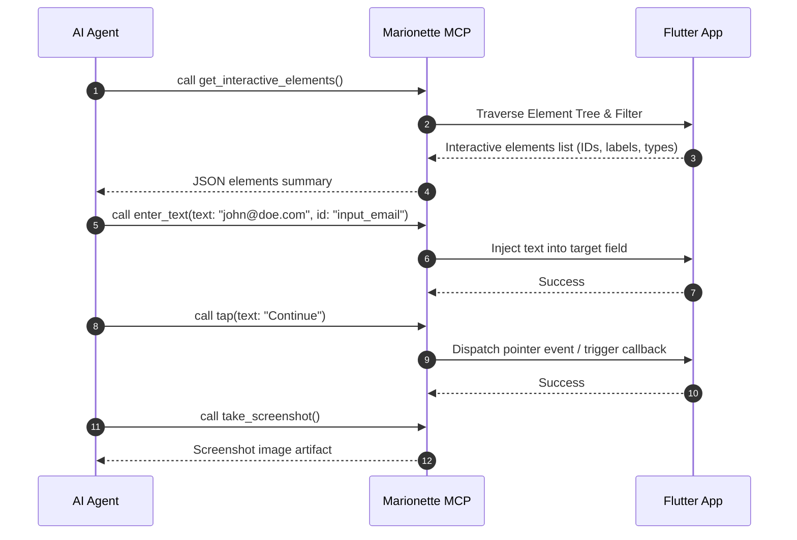

# Marionette MCP Runtime Interaction & Action Runbook

## 1. Overview & Tool Capabilities

The `marionette_mcp` server exposes focused, high-signal tools that allow AI agents to navigate and test a running Flutter application:

| MCP Tool | Description | Common Parameters |
| :--- | :--- | :--- |
| `get_interactive_elements` | Returns a structured JSON list of actionable UI elements on screen (buttons, text fields, clickable cards, tabs) with IDs and extracted text. | `{}` |
| `tap` | Performs a tap action on a target element by its text label, semantics, or element ID. | `{"text": "Login"}` or `{"id": "element_id"}` |
| `enter_text` | Inputs text into a target text field or input control. | `{"id": "field_id", "text": "user@example.com"}` or `{"text": "user@example.com"}` |
| `scroll_to` | Scrolls the enclosing scrollable viewport until the target element/text is visible. | `{"text": "Submit"}` |
| `scroll` | Scrolls a specified offset in a given direction (`up`, `down`, `left`, `right`). | `{"direction": "down", "distance": 300}` |
| `take_screenshot` | Captures the current application screen rendering as an image artifact. | `{}` |
| `get_logs` | Fetches application console logs and diagnostic messages collected by `LogCollector`. | `{}` |

---

## 2. Interaction Workflows

### 2.1 Standard Flow: Element Discovery & Click Sequence

---

## 3. Best Practices for Reliable Agent Driving

1. **Discover Before Action:** Always invoke `get_interactive_elements` after navigation or page changes to obtain fresh element IDs and visible labels.
2. **Handle Async & Animations:** Allow transitions to complete before triggering subsequent taps.
3. **Verify via Screenshots & Logs:** Use `take_screenshot` at key milestones to visually confirm UI state changes and `get_logs` to diagnose unhandled exceptions.
4. **Resilient Matching:** Prefer text-based targeting (`tap(text: "...")`) when labels are distinct, or fall back to ID-based targeting when multiple identical labels exist.

---

## 4. Related Skills

- [`marionette-hub`](../marionette-hub/SKILL.md) — Main entry point.
- [`marionette-custom-widgets`](../marionette-custom-widgets/SKILL.md) — Custom widget text extraction & interactivity.
- [`testing-integration`](../../testing-integration/SKILL.md) — Automated regression testing.
