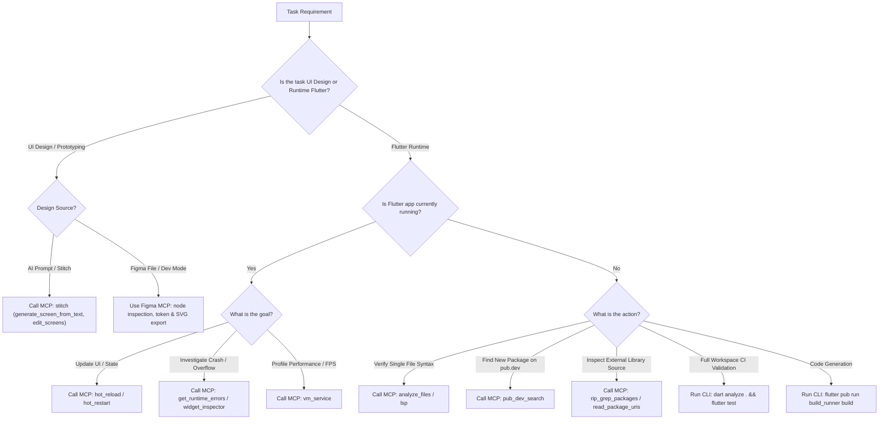

# MCP Tooling Hub: Accelerated IDE & Runtime Automation

## 1. Overview & Tooling Architecture

Antigravity IDE integrates native **Model Context Protocol (MCP)** servers that provide direct, high-speed programmatic access to runtime daemons, IDE services, analysis servers, AI design engines, and cloud providers.

Using MCP tools instead of traditional shell commands yields significant benefits:
- **Zero Process Overhead:** Instant execution without spawning cold CLI processes.
- **Structured JSON Payloads:** Type-safe programmatic responses without fragile text parsing.
- **Stateful Introspection:** Live connection to running Flutter VMs, render trees, and Dart Tooling Daemons (DTD).

```mermaid
graph TD
    Agent["Antigravity Agent"]
    
    subgraph "Dart & Flutter MCP Server (dart-mcp-server)"
        Agent -->|Hot reload / restart| HR["hot_reload / hot_restart"]
        Agent -->|Widget tree & constraints| WI["widget_inspector"]
        Agent -->|Active stack traces| RE["get_runtime_errors"]
        Agent -->|Symbols & diagnostics| LSP["lsp / analyze_files"]
        Agent -->|Package & dependency lookup| PUB["pub_dev_search / rip_grep_packages"]
        Agent -->|VM metrics & timeline| VM["vm_service / dtd"]
    end
    
    subgraph "Google Stitch MCP Server (stitch)"
        Agent -->|AI Screen Generation| ST_GEN["generate_screen_from_text"]
        Agent -->|Screen Iteration & Variants| ST_EDIT["edit_screens / generate_variants"]
        Agent -->|Design System & DESIGN.md| ST_DS["upload_design_md / apply_design_system"]
    end

    subgraph "Figma MCP / REST Interface"
        Agent -->|Dev Mode & Token Inspection| FIG_TOK["Tokens / Node Trees"]
        Agent -->|Vector & Image Export| FIG_EXP["SVG Assets -> flutter_gen"]
    end

    subgraph "Firebase MCP Server (firebase-mcp-server)"
        Agent -->|Project & SDK config| FB_CFG["firebase_get_sdk_config / firebase_init"]
        Agent -->|Security rules & deploy| FB_DEP["firebase_get_security_rules / firebase_deploy"]
    end

    subgraph "Android Management API"
        Agent -->|Device & policy inspection| AND["get_device / list_devices / get_policy"]
    end
```

---

## 2. Connected MCP Servers & Capabilities Catalog

### 2.1 `dart-mcp-server` (Dart & Flutter SDK Core)

| Tool Name | Scope & Purpose | Recommended Use Cases |
| :--- | :--- | :--- |
| `hot_reload` | Triggers sub-second hot reload on running Flutter app. | Instant visual feedback after UI, style, or method body changes. |
| `hot_restart` | Reinitializes app state without rebuilding native binary. | Resetting stateful services, BLoCs, or top-level initializers. |
| `widget_inspector` | Inspects widget tree, render objects, layout bounds, and flex constraints. | Diagnosing layout overflows, unbounded heights, and tree depth. |
| `get_runtime_errors` | Fetches active exceptions, FlutterError details, and stack traces. | Real-time bug investigation during live debugging sessions. |
| `analyze_files` | Runs fast in-memory static analysis across specified file URIs. | Verifying single or multi-file changes before full workspace builds. |
| `lsp` | Language Server Protocol integration for symbol navigation and definitions. | Finding symbol references, definitions, and code completion context. |
| `pub_dev_search` | Queries pub.dev repository for package metadata, scores, and versions. | Researching verified packages and resolving version constraints. |
| `rip_grep_packages` | Greps directly inside cached third-party dependencies and Flutter SDK. | Inspecting external package source code and method signatures. |
| `read_package_uris` | Reads resolved source contents for `package:...` URIs. | Reading underlying third-party source files without manual file path resolution. |
| `vm_service` | Direct RPC communication with Dart VM Service. | Frame timing, memory allocation profiling, and isolate inspection. |
| `flutter_driver_command`| Dispatches programmatic driver commands to running integration tests. | End-to-end user interaction simulation and widget verification. |
| `dtd` | Interfaces with Dart Tooling Daemon. | Workspace-level tool coordination and editor synchronization. |

### 2.2 `stitch` (Google Stitch UI Design & Prototyping)

| Tool Name | Scope & Purpose | Recommended Use Cases |
| :--- | :--- | :--- |
| `generate_screen_from_text` | Generates mobile/desktop UI screens from text prompts with Gemini models. | AI-driven UI exploration, wireframing, and initial mockup scaffolding. |
| `edit_screens` / `generate_variants` | Edits existing screens in-place or generates design variations. | Iterative screen refinement, layout tweaking, and A/B design exploration. |
| `upload_design_md` / `create_design_system_from_design_md` | Uploads and instantiates design tokens from `DESIGN.md`. | Design system synchronization and brand token consistency. |
| `apply_design_system` | Applies design system tokens to existing screen instances. | Re-theming and updating screens to match design system styles. |
| `get_screen` / `list_screens` | Retrieves generated screen component hierarchies, HTML, and CSS. | Inspecting generated UI structure for Flutter widget translation. |

### 2.3 `figma` (Figma MCP & Dev Mode Integration)

| Tool / Scope | Purpose | Recommended Use Cases |
| :--- | :--- | :--- |
| Node Hierarchy & Dev Mode | Inspects Figma frames, Auto-layout padding, gap, and alignment. | Translating visual layouts to Flutter `Row`, `Column`, `Wrap`, and `Sliver` trees. |
| Variable & Style Extraction | Extracts color variables, typography scales, radii, and shadows. | Mapping Figma tokens to `ColorScheme` and `AppCustomColors` (`ThemeExtension`). |
| Vector Export Pipeline | Exports SVG icons to `assets/svgs/` for compile-time safe code gen. | Icon library generation via `flutter_gen`. |

### 2.4 `firebase-mcp-server` (Firebase Cloud Ecosystem)

| Tool Name | Scope & Purpose |
| :--- | :--- |
| `firebase_get_sdk_config` | Retrieves platform SDK configuration (`google-services.json`, `GoogleService-Info.plist`). |
| `firebase_get_security_rules` | Audits and inspects Firestore and Storage security rules. |
| `firebase_deploy` | Deploys rules, functions, or hosting configurations. |
| `developerknowledge_*` | Queries official Firebase documentation and architectural patterns. |

### 2.5 `android-management-api` (Device & Enterprise)

| Tool Name | Scope & Purpose |
| :--- | :--- |
| `get_device` / `list_devices` | Inspects connected Android test devices, OS levels, and state. |
| `get_policy` / `list_policies` | Audits Android security policies and application permissions. |

---

## 3. Decision Matrix: MCP vs Terminal CLI

---

## 4. MCP Accelerated Workflows

### 4.1 Accelerated UI Debugging & Layout Fixes
1. **Detect Error:** Call `get_runtime_errors` to extract active exception stack trace.
2. **Inspect Tree:** Call `widget_inspector` on the offending widget to check render bounds and constraints.
3. **Apply Code Edit:** Fix layout using `replace_file_content` (e.g. wrap in `Expanded` or use `CustomScrollView`).
4. **Instant Verification:** Call `hot_reload` to verify fix without restarting app.

### 4.2 Generative UI with Stitch & Flutter Synthesis
1. **Generate Mockup:** Call `stitch.generate_screen_from_text` with mobile/desktop prompt.
2. **Inspect Structure:** Call `stitch.get_screen` to inspect HTML/CSS and component tree.
3. **Translate to Flutter:** Synthesize decomposed Flutter widgets (<150–200 LOC) via `design-to-flutter-ui`.
4. **Verify in Previews:** Add dual-theme `@Preview` functions and run tests.

---

## 5. Related Skills & Hubs

| Hub / Skill | Focus Area |
| :--- | :--- |
| [design-hub](../../design/design-hub/SKILL.md) | Design domain coordinator for Stitch, Figma, and Flutter UI synthesis. |
| [google-stitch-mcp](../../design/google-stitch-mcp/SKILL.md) | Google Stitch AI screen generation, editing, and `DESIGN.md` workflows. |
| [figma-mcp-integration](../../design/figma-mcp-integration/SKILL.md) | Figma MCP automation, token extraction, and SVG export. |
| [design-to-flutter-ui](../../design/design-to-flutter-ui/SKILL.md) | Translating visual mockups into clean, dual-theme Flutter UI Kit code. |
| [dart-fix-runtime-errors](../../dart-fix-runtime-errors/SKILL.md) | Runtime error resolution via `get_runtime_errors` & `hot_reload`. |
| [flutter-fix-layout-issues](../../flutter-fix-layout-issues/SKILL.md) | Layout constraint debugging via `widget_inspector`. |
| [dart-run-static-analysis](../../dart-run-static-analysis/SKILL.md) | Code quality validation with `analyze_files` and `lsp`. |
| [dart-resolve-package-conflicts](../../dart-resolve-package-conflicts/SKILL.md) | Package exploration with `pub_dev_search` and `rip_grep_packages`. |
| [performance-hub](../../performance/performance-hub/SKILL.md) | Frame rate and memory analysis with `vm_service`. |
